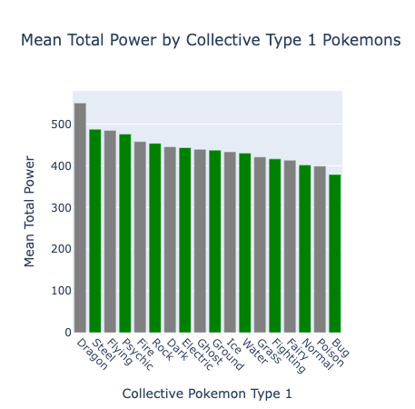
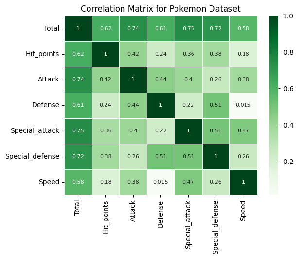
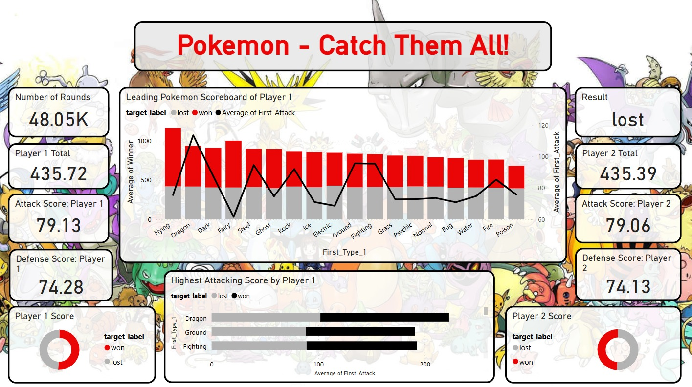
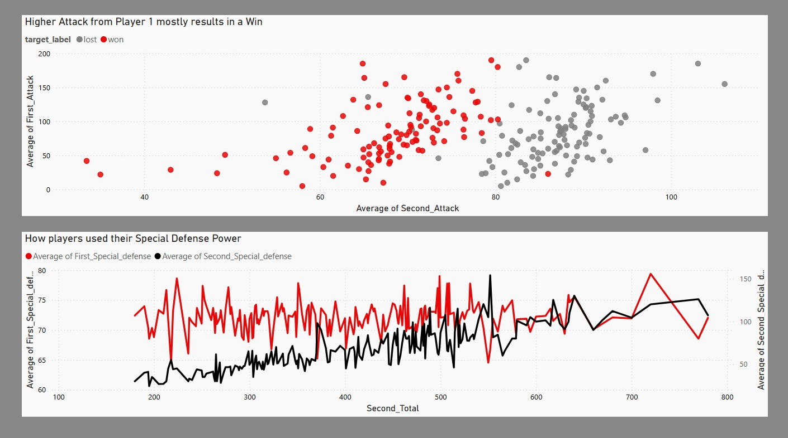
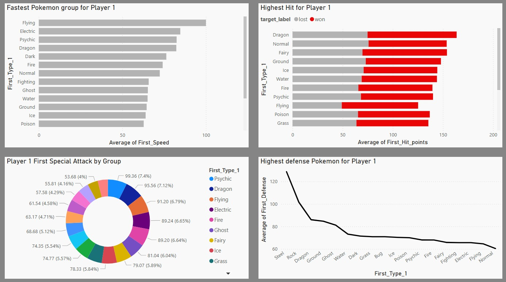
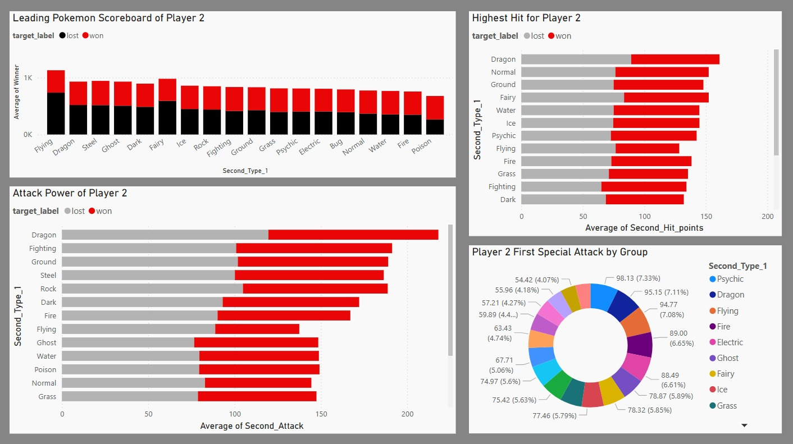

# Pokemon Catch Them All!

**Pokemon Catch Them All!** is a comprehensive data analysis tool designed to streamline data exploration, analysis, and visualisation of a Pokemon tournament between two players with various types of Pokemon. The tool supports multiple data formats and provides an intuitive interface for both novice and expert data scientists.

 

## Dataset Content
* The Kaggle dataset called \"Pokemon with stats\" and \"Pokemon- Weedle's Cave\", was used as raw data and saved under the "/Dataset/raw" folder under, [\"Pokemon with Stats\" for \"pokemon\"]( https://www.kaggle.com/datasets/abcsds/pokemon/data) and [\"Pokemon- Weedle's Cave\" for \"combats\"]( https://www.kaggle.com/datasets/terminus7/pokemon-challenge?select=pokemon.csv).
* The size of the raw files are 581KB for "combats.csv" and 44KB for "pokemon.csv".
* The column names are as follows:
    * \#: ID for each pokemon
    * Name: Name of each pokemon
    * Type 1: Each pokemon has a type, this determines weakness/resistance to attacks
    * Type 2: Some pokemon are dual type and have 2
    * Total: Sum of all stats that come after this, a general guide to how strong a pokemon is
    * HP: Hit points, or health, defines how much damage a pokemon can withstand before fainting
    * Attack: The base modifier for normal attacks (e.g. Scratch, Punch)
    * Defense: The base damage resistance against normal attacks
    * SP Atk: Special attack, the base modifier for special attacks (e.g. fire blast, bubble beam)
    * SP Def: The base damage resistance against special attacks
    * Speed: Determines which pokemon attacks first each round

       

## Business Requirements
The business requirements for this project are:

1. **Determine the Strongest Pokemon:** Identify which Pokemon have the highest overall stats and are most likely to win in tournament battles.
2. **Analyze Type Effectiveness:** Explore how different Pokemon types (Type 1 and Type 2) influence battle outcomes and identify any type advantages.
3. **Player Performance Comparison:** Compare the performance of the two players in the tournament based on their chosen Pokemon and battle results.
4. **Visualize Key Stats:** Provide clear visualizations of important attributes such as HP, Attack, Defense, Speed, and their impact on battle outcomes.
5. **Predict Battle Outcomes:** Use the dataset to build simple predictive models or rules to forecast the winner of a match based on Pokemon stats and types.
6. **User-Friendly Insights:** Present findings in a way that is accessible to both technical and non-technical users, supporting decision-making for future tournaments.

## Hypothesis and how to validate?
1. **Determine the Strongest Pokemon:** Identify which Pokemon have the highest overall stats and are most likely to win in tournament battles.
    * Visualisations were carried out in the "ETL_postprocessing and Visualisations" folder. A plotly bar chart was produced to view which Pokemon has the highest total power. The total power is calculated based on the addition of all the other characteristics that each type has.

      
    
    * A correlation matrix highlighted each characteristic type.

     

    * In the Power BI Dashboard "Pokemon_Dashboard.pbix, visualisations were also plotted of the combined data of the tables "combats.csv" and "pokemon_cleaned.csv" to provide statistics on the winning Pokemon.

     

2. **Analyze Type Effectiveness:** Explore how different Pokemon types influence battle outcomes and identify any type advantages.
    * Investigations were conducted in the Pokemon Power BI Dashboard highlighting Player 1(Type 1) vs Player 2(Type 1) advantages over the other as well as their strategies. You will find this in page 2 under "Player strategy" and page 3 and 4 under "Player 1 Statistics" and "Player 2 Statistics".

     

      

    

3. **Player Performance Comparison:** Compare the performance of the two players in the tournament based on their chosen Pokemon and battle results.
    * The Pokemon Dashboard has a comparison of the statistics between the two players. The overview page, gives a brief overview of how many wins and losses both players achieved. The "Player Strategy" and "Player 1 Statistics" and "Player 2 Statistics" give an indepth view on how each player performed.

4. **Visualize Key Stats:** Provide clear visualizations of important attributes such as HP, Attack, Defense, Speed, and their impact on battle outcomes.
    * The Pokemon Dashboard provides information on pages 3 and 4 of the Dashboard indicating this important information for each player.

5. **Predict Battle Outcomes:** Use the dataset to build simple predictive models or rules to forecast the winner of a match based on Pokemon stats and types.
    * This section is answered in page 5 of the Pokemon Dashboard named "Predictive Model". It can be used to make forecasts and predict who will be the winner based on Pokemon types and characteristics.

6. **User-Friendly Insights:** Present findings in a way that is accessible to both technical and non-technical users, supporting decision-making for future tournaments.
    * The Jupyter notebooks named "ETL_Postprocessing and Visualisations", "Statistical_testing" and "Machine_learning_model" are for the technical audience and the Pokemon Dashboard is for a non-technical audience.

## Project Plan
* Outline the high-level steps taken for the analysis.
    * ETL - This section was used to extract, clean, transform and load the two datasets - "pokemon.csv" and "combats.csv".
    * ETL Post-processing and Visualisations - This section was used to create advanced visualisations based on the "pokemon_cleaned.csv". This section was used to join two tables to create the "combined_ml.csv" which is for the battle information on player 1 and player 2. This dataset was fed into the Machine Learning Model.
    * Statistical Testing - This provided more insights into the various data distributions if they were significantly different or not.
    * Machine Learning Model - In this notebook, a Grid Search CV method was used to compare the best Machine Learning Model that a prediction could be made on that provides the highest accuracy. In this section, the Hyperparameters were also adjusted to increase the accuraxy of the Machine learning Model.
    * Pokemon Power BI Dashboard - These visualisations are based on the "combined_ml.csv" to created visualisations and a predictive model for a non-technical audience. The visuals are created to be interactive. Each page aimed at looking into a particular area about the tournament and players statistics.
* How was the data managed throughout the collection, processing, analysis and interpretation steps?
    * The raw data "pokemon.csv" and "combats.csv" was loaded and cleaned, removing duplicates, unnecessary columns, managing outliers and producing basic plots to understand the data spread and distribution.
    * The cleaned data was stored into a folder called /Dataset/cleaned/ named "pokemon_cleaned.csv" and "combats_cleaned.csv". This was used to do a left join twice of the two tables to combine them and provide statistics for both player 1 and player 2.
    * The combined table was saved as "combined_ml.csv" and used in the Machine Learning Model, Statistical Testing notebook and the Pokemon Dashboard in Power BI.

* Why did you choose the research methodologies you used?
    * This provided me with a structed and organised way to perform the ETL, visualisations, Machine Learning Model and Statistical Testing on cleaned data.

## The rationale to map the business requirements to the Data Visualisations
* List your business requirements and a rationale to map them to the Data Visualisations

    1. **Determine the Strongest Pokemon:** Identify which Pokemon have the highest overall stats and are most likely to win in tournament battles.
        * Plotly bar charts were used to create visualisations of each statistic of highest overall stats. These provided an interactive viewing platform for each visual.
        * Power BI Dashboard, I used a mix of bar charts, line charts and pie charts to summarise the highest overall stats in each characteristic.
    2. **Analyze Type Effectiveness:** Explore how different Pokemon types influence battle outcomes and identify any type advantages.
        * I used plotly bar charts in the Jupyter notebook to understand how the different types would influence the battle.
        * In the Pokemon Dashboard, I used a combination of Bar and Line charts to create the Leading Pokemon scoreboard.
    3. **Player Performance Comparison:** Compare the performance of the two players in the tournament based on their chosen Pokemon and battle results.
        * In the Pokemon Dashboard, in page 2 to 4, I used scatter point, line graphs, bar charts and pie charts to understand the differences in player performances as well as their defense strategies and attacking strategies.
    4. **Visualize Key Stats:** Provide clear visualizations of important attributes such as HP, Attack, Defense, Speed, and their impact on battle outcomes.
        * These attributes can be seen in the page 3 and page 4 of the Pokemon Dashboard with bar charts, line charts and pie charts. They assisted in showing the key attributes in the battle.
    5. **Predict Battle Outcomes:** Use the dataset to build simple predictive models or rules to forecast the winner of a match based on Pokemon stats and types.
        * In the Pokemon Dashboard, on page 5 I created a decomposition tree diagram to do a predictive analysis. This assisted in understanding who was the winner based on the top correlated features.
    6. **User-Friendly Insights:** Present findings in a way that is accessible to both technical and non-technical users, supporting decision-making for future tournaments.
        * The Jupyter notebooks support a technical audience and the Pokemon Dashboard provides information for a non-technical audience. The Dashboard has more design than the notebooks, whereas the notebooks provide more information on why certain plots were produced. For example: the correlation matrix.

## Analysis techniques used
* List the data analysis methods used and explain limitations or alternative approaches.
    * Power BI did not have any limitations, I did not need to create any geographical map, as there was no location information.
    * Plotly libraries cannot be viewed in GitHub, so they need to be downloaded separately when adding them as screenshots.
* How did you structure the data analysis techniques. Justify your response.
    * I structured my analysis for a technical and non technical audience. The Dashboard design is more fun and has basic visualisations for the tournament, this is for the non-technical audience. The Jupyter notebooks are for the technical audience.
* Did the data limit you, and did you use an alternative approach to meet these challenges? 
    * Yes, there were limitations, as the "pokemon.csv" did not have information about the players and their scores, so I had to add a second dataset called "combats.csv" to provide more information about the tournaments. The way the battles were set between player 1 vs player 2 was random.  
* How did you use generative AI tools to help with ideation, design thinking and code optimisation?
    * I made use of copilot, Chat GPT4.0 to assist me in optimising my code, providing comments and researching Data Ethics and Biases.

## Ethical considerations
* Were there any data privacy, bias or fairness issues with the data?
* How did you overcome any legal or societal issues?

## Dashboard Design
* List all dashboard pages and their content, either blocks of information or widgets, like buttons, checkboxes, images, or any other item that your dashboard library supports.
* Later, during the project development, you may revisit your dashboard plan to update a given feature (for example, at the beginning of the project you were confident you would use a given plot to display an insight but subsequently you used another plot type).
* How were data insights communicated to technical and non-technical audiences?
* Explain how the dashboard was designed to communicate complex data insights to different audiences. 

## Unfixed Bugs
* Please mention unfixed bugs and why they were not fixed. This section should include shortcomings of the frameworks or technologies used. Although time can be a significant variable to consider, paucity of time and difficulty understanding implementation are not valid reasons to leave bugs unfixed.
* Did you recognise gaps in your knowledge, and how did you address them?
* If applicable, include evidence of feedback received (from peers or instructors) and how it improved your approach or understanding.

## Development Roadmap
* What challenges did you face, and what strategies were used to overcome these challenges?
* What new skills or tools do you plan to learn next based on your project experience? 

## Deployment
### Heroku

* The App live link is: https://YOUR_APP_NAME.herokuapp.com/ 
* Set the runtime.txt Python version to a [Heroku-20](https://devcenter.heroku.com/articles/python-support#supported-runtimes) stack currently supported version.
* The project was deployed to Heroku using the following steps.

1. Log in to Heroku and create an App
2. From the Deploy tab, select GitHub as the deployment method.
3. Select your repository name and click Search. Once it is found, click Connect.
4. Select the branch you want to deploy, then click Deploy Branch.
5. The deployment process should happen smoothly if all deployment files are fully functional. Click now the button Open App on the top of the page to access your App.
6. If the slug size is too large then add large files not required for the app to the .slugignore file.

## Main Data Analysis Libraries
* Here you should list the libraries you used in the project and provide an example(s) of how you used these libraries.

## Credits 

* In this section, you need to reference where you got your content, media and extra help from. It is common practice to use code from other repositories and tutorials, however, it is important to be very specific about these sources to avoid plagiarism. 
* You can break the credits section up into Content and Media, depending on what you have included in your project. 

### Content 

- The text for the Home page was taken from Wikipedia Article A
- Instructions on how to implement form validation on the Sign-Up page was taken from [Specific YouTube Tutorial](https://www.youtube.com/)
- The icons in the footer were taken from [Font Awesome](https://fontawesome.com/)

### Media

- The photos used on the home and sign-up page are from This Open-Source site
- The images used for the gallery page were taken from this other open-source site

## Acknowledgements (optional)
* Thank the people who provided support through this project.
